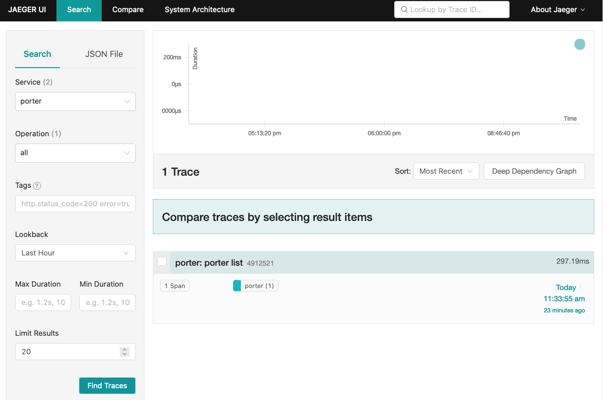

# Jaeger with OpenTelemetry

Porter v1 has experimental support for OpenTelemetry and can [send logs and trace data][diagnostics].
This bundle runs containers for Jaeger and an OpenTelemetry collector on the current host and is intended for developers to use when working on Porter.
It is not suitable for production installations.

🚨 This bundle requires access to the host, and `--allow-docker-host-access` must be set when running the bundle.

## Try it out

After installing this bundle, use the following settings in your ~/.porter/config.toml file to collect trace data:

```toml
experimental = ["structured-logs"]

[telemetry]
  enabled = true
  protocol = "grpc"
  insecure = true
```

Next, run a porter command, such as `porter list`, to generate trace data which should be sent immediately to Jaeger.
You can view the collected data by opening your browser to http://localhost:16686.



## Parameters

Use `porter explain --reference ghcr.io/getporter/examples/otel-jaeger:v0.1.0` for the most up-to-date explanation of how to run this bundle.

| Name | Default | Description |
| ---- | ------- | ----------- |
| jaeger-ui-port | 16686 | Port of the Jaeger website |
| otel-collector-port | 4317 | Port of the OpenTelemetry collector (gRPC) |

If you change the otel-collector-port, then you need to configure telemetry.endpoint. For example, if you set the port to 5000, set telemetry.endpoint to 127.0.0.1:5000.

## Install

Note that each time you install or upgrade the bundle, all existing collected data is lost.

```
porter install --reference ghcr.io/getporter/examples/otel-jaeger:v0.1.0 --allow-docker-host-access
```

[diagnostics]: https://porter.sh/administrators/diagnostics/
